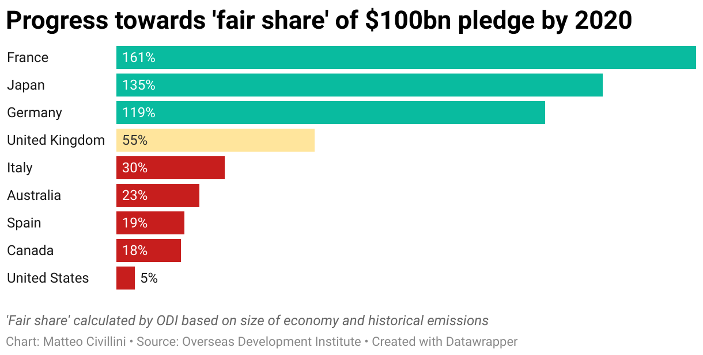

alias:: Climate Finance Provided and Mobilised by Developed Countries

- ## Infografiken:
- 
- 
- Ein wichtiges Datum ist die Zusage der Industrieländer auf der COP15 2009 in Kopenhagen, den Entwicklungsländern bis 2020 jährlich 100 Milliarden Dollar zur Verfügung zu stellen ([Climate Finance and the USD 100 Billion Goal - OECD](https://www.oecd.org/climate-change/finance-usd-100-billion-goal/ "Climate Finance and the USD 100 Billion Goal - OECD")). Diese Zusage wurde erst deutlich später eingelöst; dabei ist die Berechnung umstritten.
- Die [[OECD]] publiziert regelmäßig Reports über die Klimahilfen.