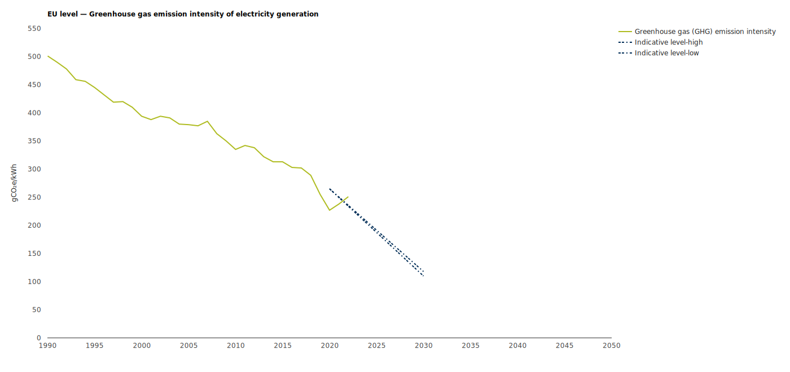

- ((664ee135-99d8-42db-a198-c0322a7802b8))
	- ([[Wiatros-Motyka et al., 2024]], p.6)
- Überblick zu Europa: [Greenhouse gas emission intensity of electricity generation — European Environment Agency](https://www.eea.europa.eu/data-and-maps/daviz/co2-emission-intensity-14/)
- ## Infografiken:
- 
	- aus: [Greenhouse gas emission intensity of electricity generation — European Environment Agency](https://www.eea.europa.eu/data-and-maps/daviz/co2-emission-intensity-14/)
-
-
-